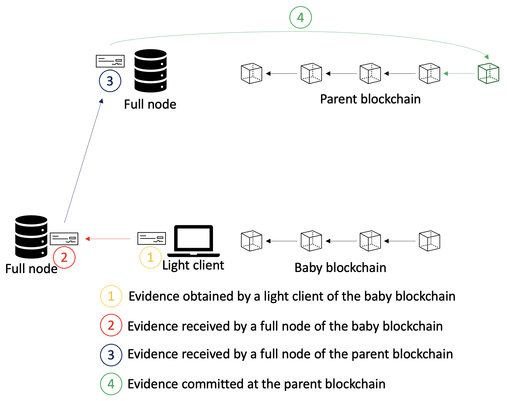

# Evidence Handling - definitions

## The protocol

This subsection provides an informal description of the evidence handling subprotocol.
We start by introducing an assumption about evidence verification and computability.

Assumption: Let *e* represent an evidence of misbehavior of a set *X* of faulty validators of the baby blockchain.
Every correct full node of the parent blockchain verifies that *e* is a valid evidence of the misbehavior of a validator *v in X*, for every *v in X*.
 The aforementioned assumption simply states that evidence could be correctly verified on the parent blockchain.

In the rest of the document, we analyze two scenarios:
1. An observed light client attack on the baby blockchain, and
2. Evidence of a misbehavior committed in a block on the baby blockchain.

We first discuss the light client attack scenario.
Then, we do the same for the second scenario.

### Light Client Attack Scenario

We first introduce entities that play a role in the evidence handling subprotocol in the light client attack scenario.

#### Light Client

A light client is a lightweight alternative to a full node.
In contrast to full nodes, light clients only verify results of transactions (without executing them).
Namely, a light client verifies block headers, given a trusted block header.
The verification of block headers is done using the skipping verification concept.

With respect to the evidence handling subprotocol, a light client of the baby blockchain is capable of observing a light client attack.
Moreover, the light client is able to inform a full node of the baby blockchain that the light client attack has indeed occurred.
Importantly, we assume that light client is able to communicate (i.e., send evidence to) at least one *correct* full node.

#### Full Node

Full nodes execute transactions submitted to a blockchain.
Similarly to light clients, they also verify results of transactions.

In our context, a full node (of the baby blockchain) receives information that a light client attack has occurred.
Then, the full node is able to deduce misbehaving validators that have mounted the attack.
Lastly, the full node is capable of transferring its deduction to full nodes of the parent blockchain.

#### Subprotocol

#### Discussion

This subsection discusses guarantees provided by the evidence handling subprotocol.
Recall that a validator could be slashed only within the *unbonding period*.
Since the unbonding period is fixed, we need to add synchrony assumptions in order for a misbehaving validator to indeed be punished.

We define the following times (times are defined with respect to the baby blockchain; moreover, global time is defined as a bfttime of the last block produced by the baby blockchain):
- Latest time of detection: *D* (this time represents a *trusting period*)
- Maximum evidence transfer delay from a light client to a full node of the baby blockchain: *T1*
- Maximum evidence transfer delay from a full node of the baby blockchain to a full node of the parent blockchain: *T2*
- Maximum evidence submit time on the parent blockchain: *S*
- Maximum evidence commit time on the parent blockchain: *C*

Now, we define when the evidence handling subprotocol is guaranteed to operate successfully, i.e., when a misbehaving validator of the baby blockchain indeed gets slashed:

Let some misbehaving validator *v* leave the validator set of the baby blockchain at some time *t*.
Validator *v* gets slashed at the parent blockchain if and only if *D + T1 + T2 + S + C <= unbonding period*.

Note that *D* (*trusting period*) and *unbonding period* are parameters of the baby blockchain.
Moreover, *D << unbonding period* so that the aforementioned equation is indeed satisfied even when other actions take long.

The evidence handling subprotocol operates successfully only if *D + T1 + T2 + S + C <= unbonding period*.
Namely, only if all of the aforementioned actions are executed "fast enough", a misbehaving validator will indeed be slashed.
Note here that we assume that time needed for a packet to be transferred from the baby to the parent blockchain is negligible.
If we assume that the time is not negligible, i.e., this transfer takes at least *X* time, we reach the following equation: *D + T1 + T2 + S + C <= unbonding period + X*.

### Committed Evidence Scenario

#### Subprotocol
The protocol for this scenario is also quite simple.
Once an evidence has been committed on the baby blockchain, it is transferred via IBC to the parent blockchain.
Once the evidence has been received on the parent blockchain, the slashing could take place (since the evidence is **already** committed on the blockchain).

Note that in this scenario there does not exist a race hazard as in the "light client attack" scenario.
The reason is that IBC ordered channels are used for the communication between two blockchains.
Hence, if the IBC packet that contains evidence is sent before the "unbonding-over" packet, then former is received before the "unbonding-over" packet.
Hence, the misbehaving validator is successfully punished.
