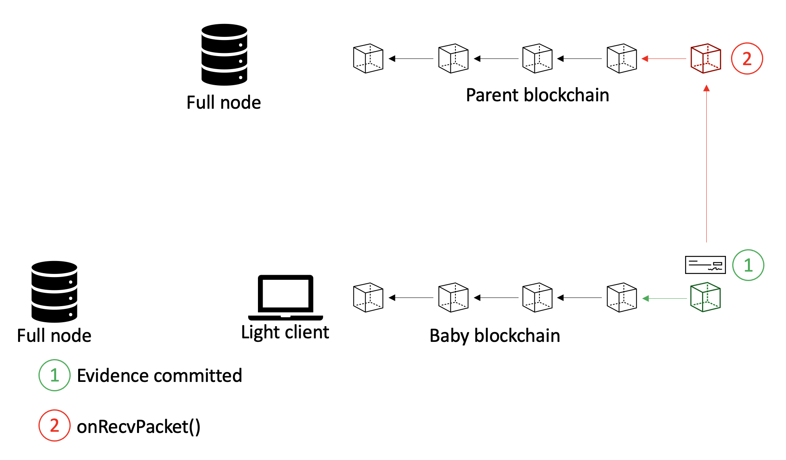

# Committed Evidence - protocol (with pseudocode)

## Pseudocode

In this document, we represent pseudocode of the evidence handling subprotocol for the "committed evidence" scenario.
<br>First, we present data structures that abstract (1) an evidence of a misbehavior of a validator,  and (2) a packet sent by the baby blockchain to the parent blockchain.
<br>Then, we present functions and callbacks needed to transfer an evidence, which is committed on the baby blockchain, to the parent blockchain.

### Data Structures

The following data structure abstracts an evidence of a misbehavior of a validator:
```golang
type InternalEvidence struct {
  evidence Evidence
  validator Validator
  chain ChainId
}
```
Namely, this data structure specifies that validator *validator* committed a misbehavior which is provable with *evidence*.
Note that we specify the identifier of chain where the misbehavior occurred (this represents a slight difference from the "single-chain" scenario).
We assume that each correct full node could verify this statement and that no verifiable evidence could ever be produced to prove a misbehavior of a correct validator.
See [Light Client Attack Detector](https://github.com/tendermint/spec/blob/master/rust-spec/lightclient/detection/detection_003_reviewed.md).

Next, we introduce a data structure that abstracts a packet with an evidence committed on the baby blockchain:
```golang
type CommittedEvidencePacket struct {
  evidence InternalEvidence
}
```

### Protocol
We now consider the protocol that is executed once an evidence of a misbehavior is committed on the baby blockchain.
The evidence is simply transferred to the parent blockchain via IBC.
<br> **Remark:** IBC channel used for transferring an evidence of a misbehavior to the parent blockchain is the same channel used for transferring the *UnbondingOver* packet (see [Validator Change Protocol](https://github.com/informalsystems/cross-chain-validation/blob/main/spec/valset-update-protocol.md)).
The evidence is transferred only if the unbonding period for the misbehaving validator has not elapsed yet (otherwise, there is no point in sending the evidence packet since the IBC channel is **ordered**).
<br> **Remark:** We do not define all the functions and callbacks needed for an IBC communication to be established between two blockchains.
For more details, please see: [Validator Change Protocol](https://github.com/informalsystems/cross-chain-validation/blob/main/spec/valset-update-protocol.md).

The following callback is triggered once there exists an evidence of a misbehavior committed on the baby blockchain:
```golang
// Invoked once there is an evidence of a misbehavior committed on the baby blockchain
func evidenceCommitted(evidence InternalEvidence) {
  // create the CommittedEvidencePacket
  CommittedEvidencePacket packet = CommittedEvidencePacket{evidence}

  // obtain the destination port of the parent blockchain
  destPort = getPort(parentChainId)

  // send the packet
  handler.sendPacket(packet, destPort)
}
```
- Expected precondition
  - Begin-Block method is executed for the block `b`
  - Evidence `evidence` is committed in `b`
- Expected postcondition
  - Packet containing information about `evidence` is created
- Error condition
  - If the precondition is violated

Moreover, the function below is triggered once a CommittedEvidencePacket is received on the parent blockchain:
```golang
// Executed at the parent blockchain to handle a delivery of the IBC packet; in this case it is exclusively a CommittedEvidencePacket
func onRecvPacket(packet: Packet) {
  // the packet is of CommittedEvidencePacket type
  assert(packet.type = CommittedEvidencePacket)

  // inform the staking module of the new evidence
  stakingModule.submitEvidence(evidence)

  // construct the default acknowledgment
  ack = defaultAck(CommittedEvidencePacket)
  return ack
}
```
- Expected precondition
  - The `CommittedEvidencePacket` is sent to the parent blockchain previously
  - The received packet is of the `CommittedEvidencePacket` type
- Expected postcondition
  - The evidence from the received packet is submitted to the staking module
  - The default acknowledgment is created
- Error condition
  - If the precondition is violated

Lastly, we describe the `submitEvidence()` function of the staking module of the parent blockchain that is responsible for "punishing" the misbehaving validator:
```golang
func stakingModule.submitEvidence(evidence InternalEvidence)
```
- Expected precondition
  - `onRecvPacket` function invoked because of the reception of a packet of the `CommittedEvidencePacket` type
- Expected postcondition
  - Validator from the `CommittedEvidencePacket` is slashed
- Error condition
  - If the precondition is violated

Note the difference between `stakingModule.submitEvidence()` and `stakingModule.processEvidences()` functions.
Namely, once the `stakingModule.submitEvidence()` function is invoked, the evidence is already committed on the parent blockchain (because of IBC) and the slashing could take place.
<br>However, `stakingModule.produceEvidences()` is invoked while the evidence(s) is still not committed on the parent blockchain.
Therefore, this function is responsible for ensuring that the evidence(s) are eventually committed and only then the slashing takes place.


