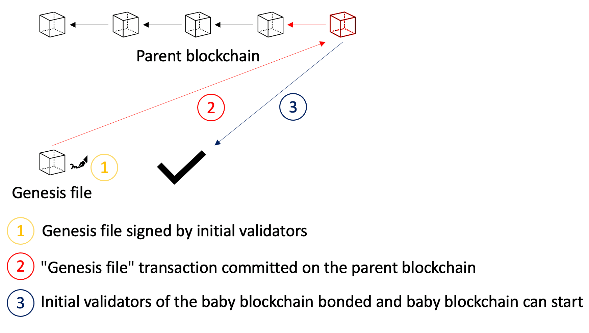

# Initialization

## Introduction

This document discusses how the initialization of the baby blockchain occurs.
Namely, we consider the parent blockchain that is already operating and we describe how validators of the parent blockchain "lend" their services to the newly created baby blockchain.

## Concept

1. There exists a genesis file of the baby blockchain denoted by F. Initial validators of the baby blockchain are specified in F. Moreover, F is signed by all initial validators of the baby blockchain such that each validator associates its identity to the public key used on the baby blockchain.
2. Transaction that contains F (signed by all validators) is committed on the parent blockchain at some time *t*. Note that F.startTime > *t* (this represents the valid assumption since the validators will indeed be keen to ensure that the transaction is committed at the right time).
3. Once this transaction is executed, initial validators of the baby blockchain are bonded.

