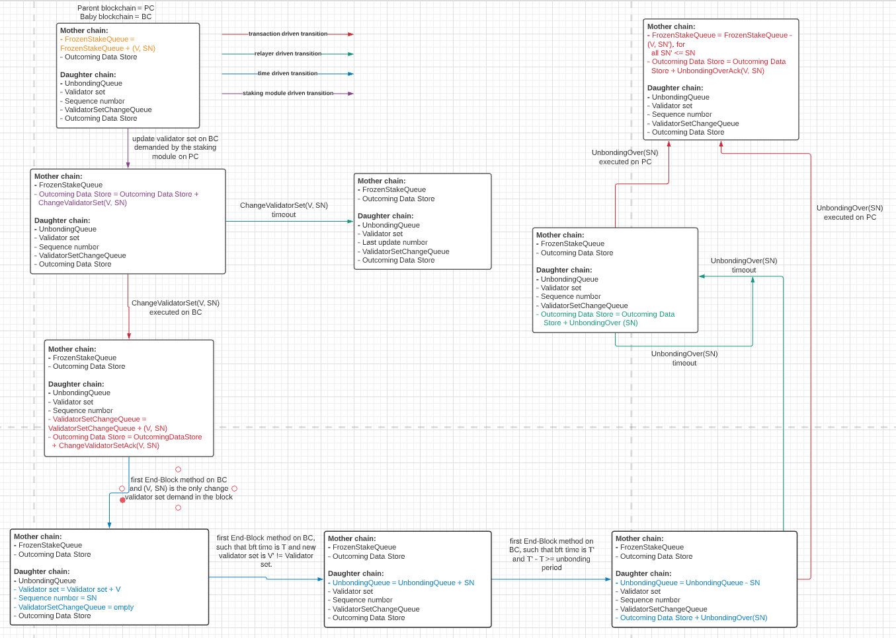
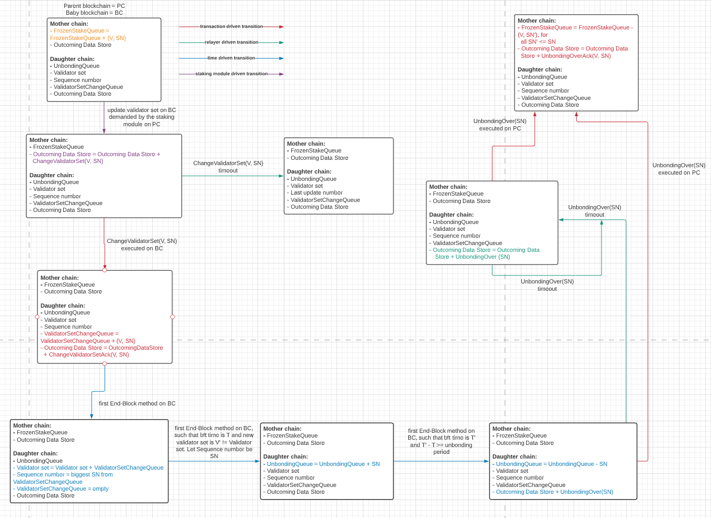

# Queue Module

## Introduction

This document presents a technical specification of the **queue module**.
The queue module contains a logic necessary for implementing shared FIFO queue among two parties (i.e., two blockchains).
Therefore, in an implementation of the FIFO queue we are interested in, the following entities take place:
  - Two blockchains: Each validator of each blockchain implements its queue module.
  - IBC communication: There exists an IBC communication among two aforementioned blockchains.
  Blockchains communicate exclusively using the IBC channels among them.

### Shared FIFO Queue Specification

Our shared FIFO queue - denoted by Q - is a concurrent object.
It exposes the following interface:
- *enqueue(x)* operation: Operation that enqueues the element *x* to Q.
- *dequeue()* operation: Operation that dequeues the first element of Q and returns that element.
- *peak()* operation: Operation that returns the first element of Q without removing it.
- *contains(x)* operation: Operation that returns whether the element *x* belongs to *Q*.

We set the following constraint:
No party (i.e., blockchain) invokes an operation before the previously invoked operation is completed.

Lastly, our implementation satisfies the **sequential consistency** correctness criterium:
The result of any execution is the same as if the operations of all the processes were executed in some sequential order, and the operations of each individual process appear in this sequence in the order specified by its protocol.

<!---
Our shared FIFO queue - denoted by Q - is a concurrent object.
We define its sequential alphabet of operations and denote it by *As*.
The sequential alphabet *As* is the set of enqueue, dequeue and peak operation: *As = {enqueue(x) | x in X} union {dequeue(x) | x in X} union {peak(x) | x in X}*, where *X* is the set of elements that could be enqueued into the queue.

The concurrent alphabet of operations of a concurrent queue is denoted by *Ac*.
Moreover, *Ac = {invocation(a) | a in As} union {response(a) | a in As}*, that is, concurrent alphabet contains all invocations and responses of the operations in *As*.

A sequential history for a concurrent queue Q is a sequence of operations *hs* that belong to *As*.
Similarly, a concurrent history for Q is a sequence of invocations and responses that belong to *Ac*.
A concurrent history is *hc* is complete if and only if for every operation invocation there exists a corresponding response that "comes" after the invocation.

Operation *m in As* precedes an operation *n in As* in a concurrent history *hc* if *response(m)* precedes *invocation(n)* in *hc*.
If operation *m* does not precede an operation *n* in *hc* and vice-versa, then operations *m* and *n* are concurrent in *hc*.
Note that precedence (i.e., order) of operations in a sequential history is clearly defined.

A sequential history *hs* is a **linearization** of a concurrent history *hc* if:
1) For any operation invocation *invocation(m)* that belongs to *hc*, the operation *m* belongs to *hs*. Moreover, no operation *n* appears in *hs* if the operation invocation *invocation(n)* does not appear in *hc*.
2) For any operations *m, n in As*, if the operation response *response(m)* precedes the operation invocation *invocation(n)* in *hc*, then the operation *m* precedes *n* in *hs*.

A concurrent history *hc* is **linearizable** if it can be extended (by adding zero or more responses) to a concurrent history *hc'* such that:
1) if there exists a linearization *hs* of *hc* such that *hs* is valid, and
2) precedence of events in *hc* is respected in *hs*.


We assume that only the producer blockchain invokes enqueue operations, whereas only the consumer blockchain invokes dequeue operations.
Both blockchains could invoke peak operations.
Lastly, no blockchain invokes an operation before the previously invoked one is completed.

Now, we define a set of valid sequential histories of Q.
Elements are enqueued in the same way they are dequeued.
Peak operation always returns the first element enqueued that has not yet been dequeued.
Exceptionally, a dequeue/peak operation returns *nil* if the queue is empty at the time of the dequeue/peak operation, i.e., every element which gets enqueued before this time was also dequeued before this time.
--->

### Closer Look at the IBC Channels

An IBC channel assumes two parties (the respective blockchains) involved in the communication. However, it also assumes a relayer which handles message transmissions between the two blockchains. The relayer carries a central responsibility in ensuring communication between the two parties through the channel.

A relayer intermediates communication between the two blockchains. Each blockchain exposes an API comprising read, write, as well as a queue (FIFO) functionality. So there are two parts to the communication API:

- a read/write store: The read/write store holds the entire state of the chain. Each module can write to this store.
- a queue of datagrams (packets): Each module can dequeue datagrams stored in this queue and a relayer can queue to this queue.

## High-Level Design of the Shared FIFO Queue

In this section, we provide an intuition behind our protocol.
Since parties (i.e., blockchains) in our model are assumed to be reliable, we choose arbitrarily one party to be *the leader*.
The leader plays a role of a "server", i.e., it orders all requests and provides replies.
Hence, the protocol is quite simple.

The leader maintains a copy of the shared FIFO queue Q.
Whenever any blockchain invokes an operation, it simply sends an IBC packet that encapsulates the invoked operation to the leader.
The leader simply processes the requests in the order in which the requests are received and provides the replies.

### Correctness Arguments

First, we note that each operation eventually completes as long as the relayer process works correctly.
Second, since the leader is a "source of order", we note that any execution is mapped into a valid sequential one (determined by the leader).
Hence, the sequential consistency criterium is satisfied.

## Data Structures

We devote this section to defining the data structures used to represent the states of both parent and baby blockchain, as well as the packets exchanged by the two blockchains.

### Application data

#### Non-leader blockchain

- Outcoming data store: "Part" of the blockchain observable for the relayer. Namely, each packet written in outcoming data store will be relayed by the relayer.

#### Leader blockchain

- Requests: Queue of requests.
- Q: Local copy of the shared FIFO queue.
- Number: Map <Element, Integer> that takes note of how many instances of a specific element is present in the local copy of Q.
- Outcoming data store: "Part" of the blockchain used for storing the packets that should be relayed to the parent blockchain (same as at the parent blockchain).

### Packet data

#### Sent by the non-leader blockchain

- OperationPacket: Packet sent by the non-leader blockchain to the leader blockchain and encapsulates an invoked operation.
More specifically, the packet has three parameters: 1) a unique identifier of the operation (can be blockchain id + sequence number), 2) type of the operation, and 3) a potential parameter (can be null).

*Remark:* There exists the default acknowledgment packet for the OperationPacket.

#### Sent by the leader blockchain

- ResultPacket: Packet sent by the leader blockchain to the non-leader blockchain and encapsulates a result of a corresponding invoked operation.
More specifically, the packet contains: 1) the identifier of the corresponding operation, and 2) the result of the operation.

*Remark:* There exists the default acknowledgment packet for the ResultPacket.

## Implementation

### Non-leader

```golang
func enqueue(x: Element) {
  // create the OperationPacket packet
  OperationPacket packet = OperationPacket{uniqueOperationId, "enqueue", x}

  // obtain the destination port of the consumer
  destPort = getPort(leaderId)

  // send the packet
  handler.sendPacket(Packet{timeoutHeight, timeoutTimestamp, destPort, destChannel, sourcePort, sourceChannel, packet}, getCapability("port"))
}
```

- Expected precondition
  - None
- Expected postcondition
  - The OperationPacket is created
- Error condition
  - If the precondition is violated

```golang
func dequeue() {
  // create the OperationPacket packet
  OperationPacket packet = OperationPacket{uniqueOperationId, "dequeue", null}

  // obtain the destination port of the consumer
  destPort = getPort(leaderId)

  // send the packet
  handler.sendPacket(Packet{timeoutHeight, timeoutTimestamp, destPort, destChannel, sourcePort, sourceChannel, packet}, getCapability("port"))
}
```

- Expected precondition
  - None
- Expected postcondition
  - The OperationPacket is created
- Error condition
  - If the precondition is violated

```golang
func peak() {
  // create the OperationPacket packet
  OperationPacket packet = OperationPacket{uniqueOperationId, "peak", null}

  // obtain the destination port of the consumer
  destPort = getPort(leaderId)

  // send the packet
  handler.sendPacket(Packet{timeoutHeight, timeoutTimestamp, destPort, destChannel, sourcePort, sourceChannel, packet}, getCapability("port"))
}
```

- Expected precondition
  - None
- Expected postcondition
  - The OperationPacket is created
- Error condition
  - If the precondition is violated

```golang
func contains(x: ELement) {
  // create the OperationPacket packet
  OperationPacket packet = OperationPacket{uniqueOperationId, "contains", x}

  // obtain the destination port of the consumer
  destPort = getPort(leaderId)

  // send the packet
  handler.sendPacket(Packet{timeoutHeight, timeoutTimestamp, destPort, destChannel, sourcePort, sourceChannel, packet}, getCapability("port"))
}
```

- Expected precondition
  - None
- Expected postcondition
  - The OperationPacket is created
- Error condition
  - If the precondition is violated

### Leader

```golang
func enqueue(x: Element) {
  // create the request
  Request req = Request{selfId, uniqueOperationId, "enqueue", x}

  // enqueue the request
  Requests.enqueue(req)
}
```

- Expected precondition
  - None
- Expected postcondition
  - The request is enqueued to the Requests queue
- Error condition
  - If the precondition is violated

```golang
func dequeue() {
  // create the request
  Request req = Request{selfId, uniqueOperationId, "dequeue", null}

  // enqueue the request
  Requests.enqueue(req)
}
```

- Expected precondition
  - None
- Expected postcondition
  - The request is enqueued to the Requests queue
- Error condition
  - If the precondition is violated

```golang
func peak() {
  // create the request
  Request req = Request{selfId, uniqueOperationId, "peak", x}

  // enqueue the request
  Requests.enqueue(req)
}
```

- Expected precondition
  - None
- Expected postcondition
  - The request is enqueued to the Requests queue
- Error condition
  - If the precondition is violated

```golang
func contains(x: Element) {
  // create the request
  Request req = Request{selfId, uniqueOperationId, "contains", x}

  // enqueue the request
  Requests.enqueue(req)
}
```

- Expected precondition
  - None
- Expected postcondition
  - The request is enqueued to the Requests queue
- Error condition
  - If the precondition is violated

```golang
func onRecvPacket(packet: Packet) {
  // the packet is of EnqueuePacket type
  assert(packet.type = OperationPacket)

  // create the request
  Request req = createRequest(packet)

  // enqueue the request
  Requests.enqueue(req)

  // construct the default acknowledgment
  ack = defaultAck(OperationPacket)
  return ack
}
```

- Expected precondition
  - The packet is sent to the leader by the non-leader blockchain
  - The packet is of *OperationPacket* type
- Expected postcondition
  - The request is enqueued to the Requests queue
- Error condition
  - If the precondition is violated

```golang
// signalizes that the Requests queue is not empty and gives the first request
func requestToProcess(Request req) {
  // apply the request to the local copy of Q
  res = Q.apply(req)

  // complete the operation
  if (req.source == selfId) {
    completeTheRequest(req.id, res)
  } else {
    // create the ResultPacket packet
    ResultPacket result = ResultPacket{req.id, res}

    // obtain the destination port of the consumer
    destPort = getPort(req.source)

    // send the packet
    handler.sendPacket(Packet{timeoutHeight, timeoutTimestamp, destPort, destChannel, sourcePort, sourceChannel, packet}, getCapability("port"))
  }
}
```

- Expected precondition
  - The Requests queue is not empty
- Expected postcondition
  - The operation takes effect in the local copy of Q
  - The corresponding operation is completed or a corresponding ResultPacket is created
- Error condition
  - If the precondition is violated

## Alternative Specification

In this section, we provide an alternative specification for the FIFO queue.
Specifically, we do not demand that all operations are linearizable.
In the rest of the subsection, we pose the following constraints:
- Enqueue operation is invoked only by the parent blockchain.
- Dequeue and peak operations are invoked only by the baby blockchain.
- Each element can be enqueued and dequeued at most once.

Enqueue, dequeue and peak operations are linearizable.
However, the contains operation behaves in the following manner:
Let *contains(x)* invoked by the baby blockchain return *true* and let another *contains(x)* operation invoked by the parent blockchain return *false*.
Then, *dequeue()* operation that returns *x* has "completed at the parent blockchain" before the *contains(x)* operation is invoked by the parent blockchain.

<!---
## Correctness Arguments

First, we note that each operation eventually completes as long as the relayer process works correctly.
Hence, we simply need to prove our implementation "maps" any execution into a valid sequential one.

We set the following serialization points for each operation:
- Enqueue operation serializes right after the moment the customer blockchain increments the number of occurrences of the received element.
- Contain operation serializes right after the moment the function returns.
- Dequeue operation serializes right after the moment the producer blockchain decrements the number of occurrences of the received element.
- Peak operation serializes right after the moment the function returns.

Because of the assumption that new operations are not invoked before the previously invoked operations are completed, we conclude that any two enqueue/contain and dequeue/peak pairs of operations could be ordered (since they can are invoked by a single blockchain).
Because of the choice of serialization points, we conclude the following:
- Any two enqueue/dequeue operations are ordered.
<!---
## Transitions

In this section, we informally discuss the state transitions that occur in our protocol.
We observe state transitions that are driven by a user (i.e., the new staking module on the parent chain), driven by the relayer and driven by elapsed time.

  - User-driven state transitions: These transitions "start" the entire process of changing the validator set of the baby blockchain.
  We assume that the staking module expresses the will to change the validator set of the baby blockchain. It is done at the End-Block method (as in the "single blockchain" scenario).

  - Transaction-driven state transitions: These are the state transitions that are driven by the relayer. Namely, these transitions are activated since communication between the two blockchains takes place. E.g., some packet is received via the IBC communication, a timeout has elapsed for a packet, acknowledgment for a packet is received.

  - Time-driven state transitions: These transitions are activated since some time has elapsed. As we will present in the rest of the document, time-driven state transitions help us determine when the unbonding period, measured at the baby blockchain, has elapsed for a validator set.

In the rest of the document, we will discuss the aforementioned state transitions in more detail.

## State Machine for a Single Validator Set Change demand

For simplicity in presentation, in this section we consider a *single* validator set change demand, that is, we assume that this demand will be a single committed validator set change demand in a block at the parent blockchain.
(If the relayer successfully transmits the protocol packet) this demand will result the validator set change indeed taking place at the baby blockchain.
However, in principle multiple demands can be issued before the first of those is finished. This leads to concurrency, and intermediate validator set changes may not be visible in the validator sets of the baby chain. We will discuss concurrency effects below.

We first describe the lifetime of a validator set change demand.
First, the staking module of the parent blockchain issues this demand by initiating the sending of the packet to the baby blockchain.
Once this packet is received by the baby blockchain, the validator set of the baby blockchain is updated to reflect the received packet and, from this point on, the "new" validator set is operating the baby blockchain.
However, once the validator set of the baby blockchain is updated, the "old" validator set starts unbonding.
Once the unbonding period for the validator set elapses, the *UnbondingOver* packet is sent to the parent blockchain.
Lastly, when the *UnbondingOver* packet is received by the parent blockchain, the stake of the validators is unfrozen.

We now present the state machine for this case.


## Function Definitions

### Functions provided by the staking module

In this subsection we explain which functions we assume are provided by the staking module.

```golang
// parent blockchain; used to unfreeze stake of validators associated with the change validator set demands (valSet, seqNum)
func unfreezeSingleStake(seqNum)
```

- Expected precondition
  - The change validator set demand *(valSet, seqNum)* issued by the staking module of the parent blockchain
- Expected postcondition
  - Stake of each validator from *valSet* associated with a sequence number *seqNum* is unfrozen
- Error condition
  - If the precondition is violated

<!---
```golang
// baby blockchain; notes that the unbonding for the specific change validator set demand started at time *time*
func startUnbonding(seqNum, time)
```

- Expected precondition
  - The validator set of the baby blockchain reflects a change validator set demand *(V, SN)*, where *SN > seqNum*
  - End-Block method is executed for the block with bft time equals to *time*
- Expected postcondition
  - The staking module notes that the unbonding for the change validator set demand *(valSet, seqNum)* started at bft time *time*
- Error condition
  - If the precondition is violated

```golang
// baby blockchain; returns all change validator set demands that started unbonding at time T', where *time* - T' >= unbonding period
// and removes them from the data structure taking note of who is currently unbonding
// (i.e., subsequent finishUnbonding calls do not return this demand)
func finishUnbonding(time)
```

- Expected precondition
  - End-Block method is executed for the block with bft time equals to *time*
- Expected postcondition
  - Returns (and removes from the data structure) all validator set change demands *(V, SN)* such that *startUnbonding(SN, time')* is invoked, where *time - time' >= unbonding period*
- Error condition
  - If the precondition is violated

**Remark.** The staking module of the baby chain needs to take care of a queue *validatorSetChangeQueue* which is used to store observed change validator set demands.
This queue is manipulated using *sizeValidatorSetChangeQueue()* to retrieve the size of the queue, *dequeueValidatorSetChange()* and *queueValidatorSetChange(valSet, seqNum)* to dequeue and queue the *validatorSetChange* queue, respectively.
-->
<!---
### Parent blockchain

This subsection will present the functions executed at the parent blockchain.

```golang
// invoked by the staking module of the parent blockchain to
// express will to modify the validator set of the baby blockchain;
// executed in the End-Block method; similarly to the "normal, single-blockchain" case
func changeValidatorSet(
  babyChainId: ChainId
  valSetUpdate: Validator[]
  seqNum: integer) {
  // create the ChangeValidatorSet packet
  ChangeValidatorSet data = ChangeValidatorSet{valSetUpdate, seqNum}

  // obtain the destination port of the baby blockchain
  destPort = getPort(babyChainId)

  // send the packet
  handler.sendPacket(Packet{timeoutHeight, timeoutTimestamp, destPort, destChannel, sourcePort, sourceChannel, data}, getCapability("port"))
}
```

- Expected precondition
  - There exists a blockchain with *babyChainId* identifier
  - All validators from *valSetUpdate* are validators at the parent blockchain
  - Stake of each validator from *valSetUpdate* is frozen and associated with this demand (via *seqNum*)
- Expected postcondition
  - The packet containing information about this change validator set demand is created
- Error condition
  - If the precondition is violated

```golang
// executed at the parent blockchain to handle a delivery of the IBC packet
func onRecvPacket(packet: Packet) {
  // the packet is of UnbondingOver type
  assert(packet.type = UnbondingOver)

  seqNum = packet.seqNum

  // unfreeze stake of validators associated with sequence numbers <= seqNum
  while (true) {
    // peak the first queue entry
    sn = peakFrozenStakeQueue()

    // sequence number lower than the received one
    if (sn <= seqNum) {
      // remove the entry from the queue
      sn = dequeueFrozenStakeQueue()

      // unfreeze stake
      stakingModule.unfreezeSingleStake(sn)
    } else {
      // otherwise, exit the loop
      break;
    }
  }

  // construct the default acknowledgment
  ack = defaultAck(UnbondingOver)
  return ack
}
```

- Expected precondition
  - The *ChangeValidatorSet* packet is sent to the baby blockchain before this packet is received
  - The packet is of the *UnbondingOver* type
- Expected postcondition
  - Entry associated with a sequence number *seqNum' <= seqNum* is dequeued from the *FrozenStakeQueue* queue
  - Stake of each validator from *valSet* associated with a sequence number *seqNum' <= seqNum* is unfrozen
  - The default acknowledgment is created
- Error condition
  - If the precondition is violated

```golang
// called once a sent packet has timed-out
function onTimeoutPacket(packet: Packet) {
  // the packet is of ChangeValidatorSet type
  assert(packet.type = ChangeValidatorSet)

  valSet = packet.valSet
  seqNum = packet.seqNum

  // unfreeze stake of validators associated with this seqNum
  stakingModule.unfreezeSingleStake(seqNum)
}
```

- Expected precondition
  - The *packet* has timed out
- Expected postcondition
  - Stake of each validator from *valSet* associated with a sequence number *seqNum* is unfrozen
- Error condition
  - If the precondition is violated  

### Baby blockchain

```golang
// executed at the baby blockchain to handle a delivery of the IBC packet
func onRecvPacket(packet: Packet) {
  // the packet is of ChangeValidatorSet type
  assert(packet.type = ChangeValidatorSet)

  valSetUpdate = packet.valSetUpdate
  seqNum = packet.seqNum

  // inform the staking module of the new validator set change demand via the ValidatorSetChangeQueue
  stakingModule.enqueueValidatorSetChangeQueue(valSetUpdate, seqNum)

  // construct the default acknowledgment
  ack = defaultAck(ChangeValidatorSet)
  return ack
}
```

- Expected precondition
  - The packet is of the *ChangeValidatorSet* type
- Expected postcondition
  - The staking module enqueues the new validator set change demand (i.e., the new entry associated with the received packet is enqueued to the *ValidatorSetChangeQueue* queue)
  - The default acknowledgment is created
- Error condition
  - If the precondition is violated

```golang
// End-Block method executed at the end of each block
func endBlock(block: Block) {
  // get time
  time = block.time

  // get the old validator set
  oldValSet, oldSeqNum = block.validatorSet

  // get the new validator set; init to the old one
  newValSet = oldValSet

  // start unbonding for the old validator set represented by the validator set update;
  // "start unbonding" simply means adding to the queue of validator set changes that started unbonding
  stakingModule.enqueueUnbondingQueue(oldSeqNum, time)

  // update the validator set
  while (stakingModule.sizeValidatorSetChangeQueue() > 0) {
    valSetUpdate, valSetUpdateSeqNum = stakingModule.dequeueValidatorSetChangeQueue()

    // update the new validator set
    newValSet = applyValidatorUpdate(newValSet, valSetUpdate)

    // remember which demands participate
    if (stakingModule.isEmptyValidatorSetChangeQueue()) {
      newSeqNum = valSetUpdateSeqNum
    }
  }

  // finish unbonding for mature validator sets
  while (true) {
    // peak the first queue entry
    seqNum, startTime = stakingModule.peakUnbondingQueue()

    if (startTime + UNBONDING_PERIOD >= time) {
      // remove from the unbonding queue
      seqNum, startTime = stakingModule.dequeueUnbondingQueue()

      // create the UnbondingOver packet
      UnbondingOver data = UnbondingOver{seqNum}

      // obtain the destination port of the baby blockchain
      destPort = getPort(parentChainId)

      // send the packet
      handler.sendPacket(Packet{timeoutHeight, timeoutTimestamp, destPort, destChannel, sourcePort, sourceChannel, data}, getCapability("port"))
    } else {
      break
    }
  }

  return newValSet, newSeqNum
}
```

- Expected precondition
  - Every transaction from the *block* is executed
- Expected postcondition
  - Unbonding starts for the old validator set
  - Unbonding finishes for all validator set that started unbonding more than *unbondingTime* before *time = block.time*. Moreover, the *UnbondingOver* packet is created for each such validator set
  - The new validator set *newValSet* is pushed to the Tendermint protocol and *newValSet* reflects all the change validator set demands from the *block*
- Error condition
  - If the precondition is violated


```golang
// called once a sent packet has timed-out
function onTimeoutPacket(packet: Packet) {
  // the packet is of UbondingOver type
  assert(packet.type = UnbondingOver)

  seqNum = packet.seqNum

  // create the UnbondingOver packet
  UnbondingOver data = UnbondingOver{seqNum}

  // obtain the destination port of the baby blockchain
  destPort = getPort(parentChainId)

  // send the packet
  handler.sendPacket(Packet{timeoutHeight, timeoutTimestamp, destPort, destChannel, sourcePort, sourceChannel, data}, getCapability("port"))
}
```

- Expected precondition
  - The *packet* has timed out
- Expected postcondition
  - The *UnbondingOver* packet is created again
- Error condition
  - If the precondition is violated


### Port & channel setup

The `setup` function must be called exactly once when the module is created
to bind to the appropriate port.

```golang
func setup() {
  capability = routingModule.bindPort("cross-chain staking", ModuleCallbacks{
    onChanOpenInit,
    onChanOpenTry,
    onChanOpenAck,
    onChanOpenConfirm,
    onChanCloseInit,
    onChanCloseConfirm,
    onRecvPacket,
    onTimeoutPacket,
    onAcknowledgePacket,
    onTimeoutPacketClose
  })
  claimCapability("port", capability)
}
```

Once the `setup` function has been called, channels can be created through the IBC routing module
between instances of the cross-chain staking modules on mother and daughter chains.

##### Channel lifecycle management

Mother and daughter chains accept new channels from any module on another machine, if and only if:

- The channel being created is ordered.
- The version string is `icsXXX`.

```golang
func onChanOpenInit(
  order: ChannelOrder,
  connectionHops: [Identifier],
  portIdentifier: Identifier,
  channelIdentifier: Identifier,
  counterpartyPortIdentifier: Identifier,
  counterpartyChannelIdentifier: Identifier,
  version: string) {
  // only ordered channels allowed
  abortTransactionUnless(order === ORDERED)
  // assert that version is "icsXXX"
  abortTransactionUnless(version === "icsXXX")
}
```

```golang
func onChanOpenTry(
  order: ChannelOrder,
  connectionHops: [Identifier],
  portIdentifier: Identifier,
  channelIdentifier: Identifier,
  counterpartyPortIdentifier: Identifier,
  counterpartyChannelIdentifier: Identifier,
  version: string,
  counterpartyVersion: string) {
  // only ordered channels allowed
  abortTransactionUnless(order === ORDERED)
  // assert that version is "icsXXX"
  abortTransactionUnless(version === "icsXXX")
  abortTransactionUnless(counterpartyVersion === "icsXXX")
}
```

```golang
func onChanOpenAck(
  portIdentifier: Identifier,
  channelIdentifier: Identifier,
  version: string) {
  // port has already been validated
  // assert that version is "icsXXX"
  abortTransactionUnless(version === "icsXXX")
}
```

```golang
func onChanOpenConfirm(
  portIdentifier: Identifier,
  channelIdentifier: Identifier) {
  // accept channel confirmations, port has already been validated, version has already been validated
}
```

```golang
func onChanCloseInit(
  portIdentifier: Identifier,
  channelIdentifier: Identifier) {
  // the channel is closing, do we need to punish?
}
```

```golang
func onChanCloseConfirm(
  portIdentifier: Identifier,
  channelIdentifier: Identifier) {
  // the channel is closed, do we need to punish?
}
```

## State Machine for Multiple Validator Set Change demands

Note that "multiple" signalizes that more than one demand of the change validator set type is committed in a block at the baby blockchain.
If that happens, all updates take place.
Note that some updates might not be visible, i.e., their effect might be hidden by subsequent demands.

The image below illustrates this case.



## Correctness Arguments

Here we provide correctness arguments for the liveness, stake safety and stake liveness properties.

### Liveness
Suppose that the IBC communication indeed successfully relays the demand *ChangeValidatorSet(V, SN)* to the baby blockchain.
Therefore, the validator set of the baby blockchain should reflect this demand.
This indeed happens at the end of a block, since every observed demand is applied in order for the baby blockchain to calculate the new validator set.
Hence, the property is satisfied.

### Validator set change safety
Suppose that the validator set of the baby blockchain changes from *V* to *V'* in two consecutive blocks.
By construction of the protocol, we conclude that there exists a sequence of change validator set demands issued by the parent blockchain that result in *V'* when applied to *V*.
Recursively, we conclude that this holds for any two validator sets (irrespectively of the "block distance" between them).

### Stake safety

If the validator *v* belong to the validator set of the baby blockchain, we know that a *ChangeValidatorSet(V, SN)* is demanded by the parent blockchain, where *v in V*.
Since the stake is frozen at the moment of sending this demand, the first statement of the property is satisfied.

A stake of a validator *v* is unfrozen at the parent blockchain upon a reception of the *UnbondingOver* packet.
Since this packet is sent by the baby blockchain only after the unbonding period has elapsed, the second claim of the property holds.

### Stake liveness
The unbonding period for each validator eventually elapses.
Since the *UnbondingOver* packet is resent until the packet is received by the parent blockchain, the stake is eventually unfrozen.

## Generalization

Note that we assume a single baby blockchain per a parent blockchain.
However, the protocol itself allows that a single parent blockchain takes care of multiple baby blockchains.
The only difference would be that the parent blockchain takes care of each "cross-chain validation"-related parameter **per** baby blockchain (i.e., the sequence numbers for the change validator set demands would be **per** baby blockchain, the "stake freezing" logic would be **per** baby blockchain, etc.).
--->
