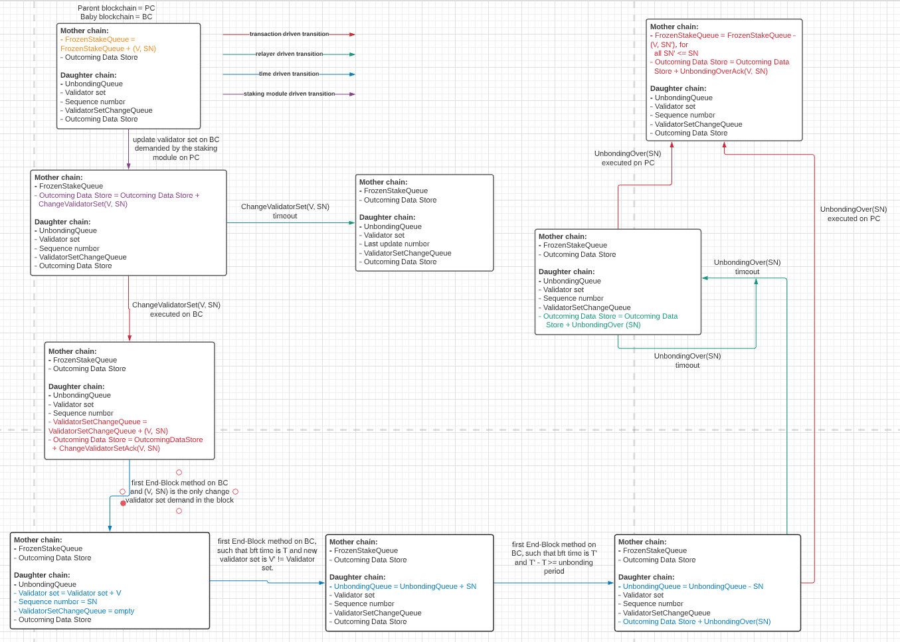
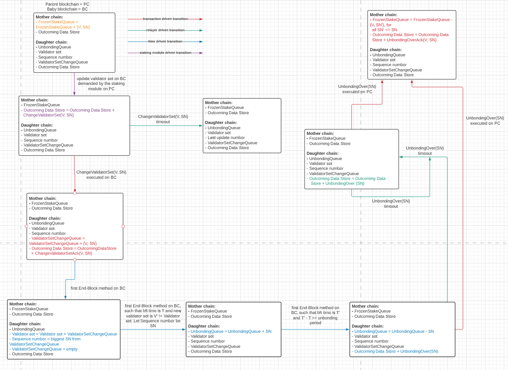

# Technical Specification

## Introduction

This document presents a technical specification for the **Cross-Chain Validation** protocol.
The basic idea of the Cross-Chain Validation protocol is to allow validators that are already securing some existing blockchain (parent blockchain) to also secure a "new" blockchain (baby blockchain).
The stake bonded at the parent blockchain guarantees that a validator behaves correctly at the baby blockchain.
Otherwise, the validator is slashed on the parent blockchain.

Therefore, at a high level, we can imagine the Cross-Chain Validation protocol to be concerned with following entities:
  - Parent blockchain: This is a blockchain that "provides" validators. Namely, "provided" validators have some stake at the parent blockchain. Any misbehavior of a validator is slashed at the parent blockchain. Moreover, parent blockchain manipulates the validator set of a chain that "borrows" validators from it.
  - Baby blockchain: Baby blockchain is a blockchain that is being secured by the parent blockchain. In other words, validators that secure and operate the baby blockchain are bonded on the parent blockchain. Any misbehavior of a validator at the baby blockchain is punished at the parent blockchain (i.e., the validator is slashed at the parent blockchain).
  - Causally consistent shared FIFO queue: This queue is used for communication among two blockchains, as we explain in the rest of the document.

Note that the protocol we present is generalized to multiple baby blockchains.
In other words, a single parent blockchain might have multiple baby blockchains under its "jurisdiction".
Hence, the Cross-Chain Validation protocol is concerned with more than two entities (one parent blockchain and potentially multiple baby blockchains).

### Properties

This subsection is devoted to defining properties that the Cross-Chain Validation protocol ensures.
Recall that the parent blockchain has an ability to demand a change to the validator set of the baby chain.
Moreover, we want to ensure the stake of validators of the baby blockchain are "frozen" at the parent chain.

We present the interface of the protocol:
  - Request: <ChangeValidatorSet, babyChain, V> - request made by the parent blockchain to change the validator set of babyChain using the validator set updates V.
  We assume that each validator set update is unique (e.g., each validator set update V could simply have a unique identifier).
  - Indication: <Unbonded, babyChain, V> - indication to the parent blockchain that the validator set update V (i.e., its "effect") has unbonded on the baby blockchain.

Hence, we aim to achieve the following properties:
- *Liveness*: If the parent blockchain demands a validator set change V for the baby chain, then the validator set of the baby blockchain reflects this demand.
- *Validator set change safety*: Suppose that the validator set of the baby blockchain changes from *V* to *V'*. Then, there exists a sequence *seq = V1, V2, ..., Vn*, where *n > 0*, of change validator set demands issued by the parent blockchain such that *apply(V, seq) = V'*.
- *Validator set change liveness*: If there exist infinitely many <ChangeValidatorSet, babyChain, V'> issued after <ChangeValidatorSet, babyChain, V>, then <Unbonded, babyChain, V> is eventually triggered.

Let us explain the validator set change liveness property.
First, note that <Unbonded, babyChain, Vlast> is never triggered if Vlast represent the **final** validator set change demand issued by the parent blockchain (the reason is that the validator set of the baby blockchain will never change after Vlast).
Hence, it might be enough for V not to be the last demanded change.
Unfortunatelly, that is not the case since multiple validator set change demands might be committed in the same block as the last demand.
That is why we demand infinitely many demands to be issued after V.
Note that if B represents the number of transactions committed in each block, then it is sufficient to demand B validator set change demands to be issued in order for V to eventually unbond.

<!---
### Closer look at the IBC channels

An IBC channel assumes two parties (the respective blockchains) involved in the communication. However, it also assumes a relayer which handles message transmissions between the two blockchains. The relayer carries a central responsibility in ensuring communication between the two parties through the channel.

A relayer intermediates communication between the two blockchains. Each blockchain exposes an API comprising read, write, as well as a queue (FIFO) functionality. So there are two parts to the communication API:

- a read/write store: The read/write store holds the entire state of the chain. Each module can write to this store.
- a queue of datagrams (packets): Each module can dequeue datagrams stored in this queue and a relayer can queue to this queue.

--->

## High-level design of the Cross-Chain Validation protocol

In this section, we provide an intuition behind our protocol.

We use the causally consistent FIFO queue for "communication" among two blockchains (parent and baby).
Namely, the parent blockchain enqueues new validator set changes and the baby blockchain dequeues these validator set changes once they have unbonded on the baby blockchain (which represents a signal that the stake of those validator could be set free by the parent blockchain).

- Parent blockchain: Once the parent blockchain demands a change of validator set, it enqueues the validator set.

- Baby blockchain: Once the baby blockchain observes that there exist new validator set demands, the baby blockchain applies all these changes.
Moreover, whenever the validator set of the baby blockchain is modified, the "old" validator set should start unbonding.
That is the baby blockchain uses the **local** *UnbondingQueue* queue.
Namely, whenever the validator set of the baby blockchain is modified, we enqueue to *UnbondingQueue* the sequence number of the validator set change demand that was **last** applied in order to obtain the old (i.e., changed) validator set.
Once the unbonding period elapses for the validator set, the appropriate entry is dequeued from the shared queue.

## Data Structures

We devote this section to defining the data structures used to represent the states of both parent and baby blockchain, as well as the packets exchanged by the two blockchains.

### Application data

#### Parent blockchain

- Q: The causally consistent FIFO shared queue.

#### Baby blockchain

- Q: The causally consistent FIFO shared queue.
- *UnbondingQueue*: Keeps track of validators that are currently unbonding.
- validatorSetSeqNum: Number of validator set change demands processed; initialized to 0.
- dequeueSeqNum: Number of elements dequeued from Q; initialized to 0.
- lastObserved: Element of Q that was observed during the last Q.read() operation; initializated to nil.

## Transitions

In this section, we informally discuss the state transitions that occur in our protocol.
We observe state transitions that are driven by a user (i.e., the new staking module on the parent chain), driven by the relayer and driven by elapsed time.

  - User-driven state transitions: These transitions "start" the entire process of changing the validator set of the baby blockchain.
  We assume that the will to change the validator set of the baby blockchain babyChain is expressed by invoking <ChangeValidatorSet, babyChain, V>.

  - Time-driven state transitions: These transitions are activated since some time has elapsed. As we will present in the rest of the document, time-driven state transitions help us determine when the unbonding period, measured at the baby blockchain, has elapsed for a validator set.

In the rest of the document, we will discuss the aforementioned state transitions in more detail.

<!---
## State Machine for a Single Validator Set Change demand

For simplicity in presentation, in this section we consider a *single* validator set change demand, that is, we assume that this demand will be a single committed validator set change demand in a block at the parent blockchain.
(If the relayer successfully transmits the protocol packet) this demand will result the validator set change indeed taking place at the baby blockchain.
However, in principle multiple demands can be issued before the first of those is finished. This leads to concurrency, and intermediate validator set changes may not be visible in the validator sets of the baby chain. We will discuss concurrency effects below.

We first describe the lifetime of a validator set change demand.
First, the staking module of the parent blockchain issues this demand by initiating the sending of the packet to the baby blockchain.
Once this packet is received by the baby blockchain, the validator set of the baby blockchain is updated to reflect the received packet and, from this point on, the "new" validator set is operating the baby blockchain.
However, once the validator set of the baby blockchain is updated, the "old" validator set starts unbonding.
Once the unbonding period for the validator set elapses, the *UnbondingOver* packet is sent to the parent blockchain.
Lastly, when the *UnbondingOver* packet is received by the parent blockchain, the stake of the validators is unfrozen.

We now present the state machine for this case.

--->

## Function Definitions

<!---
### Functions provided by the staking module

In this subsection we explain which functions we assume are provided by the staking module.

```golang
// parent blockchain; used to unfreeze stake of validators associated with the change validator set demands (valSet, seqNum)
func unfreezeSingleStake(seqNum)
```

- Expected precondition
  - The change validator set demand *(valSet, seqNum)* issued by the staking module of the parent blockchain
- Expected postcondition
  - Stake of each validator from *valSet* associated with a sequence number *seqNum* is unfrozen
- Error condition
  - If the precondition is violated
  --->

<!---
```golang
// baby blockchain; notes that the unbonding for the specific change validator set demand started at time *time*
func startUnbonding(seqNum, time)
```

- Expected precondition
  - The validator set of the baby blockchain reflects a change validator set demand *(V, SN)*, where *SN > seqNum*
  - End-Block method is executed for the block with bft time equals to *time*
- Expected postcondition
  - The staking module notes that the unbonding for the change validator set demand *(valSet, seqNum)* started at bft time *time*
- Error condition
  - If the precondition is violated

```golang
// baby blockchain; returns all change validator set demands that started unbonding at time T', where *time* - T' >= unbonding period
// and removes them from the data structure taking note of who is currently unbonding
// (i.e., subsequent finishUnbonding calls do not return this demand)
func finishUnbonding(time)
```

- Expected precondition
  - End-Block method is executed for the block with bft time equals to *time*
- Expected postcondition
  - Returns (and removes from the data structure) all validator set change demands *(V, SN)* such that *startUnbonding(SN, time')* is invoked, where *time - time' >= unbonding period*
- Error condition
  - If the precondition is violated

**Remark.** The staking module of the baby chain needs to take care of a queue *validatorSetChangeQueue* which is used to store observed change validator set demands.
This queue is manipulated using *sizeValidatorSetChangeQueue()* to retrieve the size of the queue, *dequeueValidatorSetChange()* and *queueValidatorSetChange(valSet, seqNum)* to dequeue and queue the *validatorSetChange* queue, respectively.
-->

### Parent blockchain

This subsection will present the functions executed at the parent blockchain.

```golang
// expresses will to modify the validator set of the baby blockchain;
func changeValidatorSet(
  babyChainId: ChainId
  valSetUpdate: Validator[]
) {
  // enqueue to the queue shared with babyChainId
  Q[babyChainId].enqueue(valSetUpdate)
}
```

- Expected precondition
  - There exists a blockchain with *babyChainId* identifier
  - All validators from *valSetUpdate* are validators at the parent blockchain
- Expected postcondition
  - The valSetUpdate is enqueued to the queue shared with the blockchain with *babyChainId*
- Error condition
  - If the precondition is violated

<!---
```golang
// executed at the parent blockchain to handle a delivery of the IBC packet
func onRecvPacket(packet: Packet) {
  // the packet is of UnbondingOver type
  assert(packet.type = UnbondingOver)

  seqNum = packet.seqNum

  // unfreeze stake of validators associated with sequence numbers <= seqNum
  while (true) {
    // peak the first queue entry
    sn = peakFrozenStakeQueue()

    // sequence number lower than the received one
    if (sn <= seqNum) {
      // remove the entry from the queue
      sn = dequeueFrozenStakeQueue()

      // unfreeze stake
      stakingModule.unfreezeSingleStake(sn)
    } else {
      // otherwise, exit the loop
      break;
    }
  }

  // construct the default acknowledgment
  ack = defaultAck(UnbondingOver)
  return ack
}
```

- Expected precondition
  - The *ChangeValidatorSet* packet is sent to the baby blockchain before this packet is received
  - The packet is of the *UnbondingOver* type
- Expected postcondition
  - Entry associated with a sequence number *seqNum' <= seqNum* is dequeued from the *FrozenStakeQueue* queue
  - Stake of each validator from *valSet* associated with a sequence number *seqNum' <= seqNum* is unfrozen
  - The default acknowledgment is created
- Error condition
  - If the precondition is violated

```golang
// called once a sent packet has timed-out
function onTimeoutPacket(packet: Packet) {
  // the packet is of ChangeValidatorSet type
  assert(packet.type = ChangeValidatorSet)

  valSet = packet.valSet
  seqNum = packet.seqNum

  // unfreeze stake of validators associated with this seqNum
  stakingModule.unfreezeSingleStake(seqNum)
}
```

- Expected precondition
  - The *packet* has timed out
- Expected postcondition
  - Stake of each validator from *valSet* associated with a sequence number *seqNum* is unfrozen
- Error condition
  - If the precondition is violated  
--->

### Baby blockchain

<!---
```golang
// executed at the baby blockchain to handle a delivery of the IBC packet
func onRecvPacket(packet: Packet) {
  // the packet is of ChangeValidatorSet type
  assert(packet.type = ChangeValidatorSet)

  valSetUpdate = packet.valSetUpdate
  seqNum = packet.seqNum

  // inform the staking module of the new validator set change demand via the ValidatorSetChangeQueue
  stakingModule.enqueueValidatorSetChangeQueue(valSetUpdate, seqNum)

  // construct the default acknowledgment
  ack = defaultAck(ChangeValidatorSet)
  return ack
}
```

- Expected precondition
  - The packet is of the *ChangeValidatorSet* type
- Expected postcondition
  - The staking module enqueues the new validator set change demand (i.e., the new entry associated with the received packet is enqueued to the *ValidatorSetChangeQueue* queue)
  - The default acknowledgment is created
- Error condition
  - If the precondition is violated

-->

```golang
// function used in End-Block method
// returns all the elements enqueued since the last invocation of this method
func observeChangesQ() { 
  // get the content of the shared queue
  content = Q.read()

  // check whether the last observed element is in content
  if (!content.has(lastObserved)) {
    // update the lastObserved to the last element of content if content is not empty
    if (!content.empty()) lastObserved = content.last()

    // return the entire content
    return content
  } else {
    // set "old" lastObserved
    oldLastObserved = lastObserved

    // update the lastObserved to the last element of content
    lastObserved = content.last()

    // return the entire content of content starting from oldLastObserved (excluding oldLastObserved)
    return content.startFrom(oldLastObserved)
  }
}
```

- Expected precondition
  - None
- Expected postcondition
  - Returns the elements enqueued since the last Q.read() operation was invoked.
- Error condition
  - None

```golang
// End-Block method executed at the end of each block
func endBlock(block: Block) {
  // get time
  time = block.time

  // finish unbonding for mature validator sets
  while (true) {
    // peak the first queue entry
    seqNum, startTime = UnbondingQueue.peak()

    if (startTime + UNBONDING_PERIOD >= time) {
      // remove from the unbonding queue
      seqNum, startTime = UnbondingQueue.dequeue()

      // dequeue all elements until seqNum
      for (i = dequeueSeqNum + 1; i <= seqNum; i++) {
        Q.dequeue()
      }
      dequeueSeqNum = seqNum

    } else {
      break
    }
  }

  // get the new changes
  changes = observeChangesQ()

  // if there are no changes, return currnt validator set
  if (changes.empty()) return block.validatorSet

  // get the old validator set
  oldValSet = block.validatorSet

  // get the new validator set; init to the old one
  newValSet = oldValSet

  // start unbonding for the old validator set represented by the validator set update;
  // "start unbonding" simply means adding to the queue of validator set changes that started unbonding
  stakingModule.enqueueUnbondingQueue(validatorSetSeqNum, time)

  // update the validator set
  while (!content.isEmpty()) {
    valSetUpdate = content.dequeue()

    // update the new validator set
    newValSet = applyValidatorUpdate(newValSet, valSetUpdate)

    // increment validatorSetSeqNum
    validatorSetSeqNum++

    // remember which demands participate
    if (content.isEmpty()) {
      newSeqNum = validatorSetSeqNum
    }
  }

  return newValSet
}
```

- Expected precondition
  - Every transaction from the *block* is executed
- Expected postcondition
  - Unbonding starts for the old validator set
  - Unbonding finishes for all validator set that started unbonding more than *unbondingTime* before *time = block.time*. Moreover, the *UnbondingOver* packet is created for each such validator set
  - The new validator set *newValSet* is pushed to the Tendermint protocol and *newValSet* reflects all the change validator set demands from the *block*
- Error condition
  - If the precondition is violated

<!---

```golang
// called once a sent packet has timed-out
function onTimeoutPacket(packet: Packet) {
  // the packet is of UbondingOver type
  assert(packet.type = UnbondingOver)

  seqNum = packet.seqNum

  // create the UnbondingOver packet
  UnbondingOver data = UnbondingOver{seqNum}

  // obtain the destination port of the baby blockchain
  destPort = getPort(parentChainId)

  // send the packet
  handler.sendPacket(Packet{timeoutHeight, timeoutTimestamp, destPort, destChannel, sourcePort, sourceChannel, data}, getCapability("port"))
}
```

- Expected precondition
  - The *packet* has timed out
- Expected postcondition
  - The *UnbondingOver* packet is created again
- Error condition
  - If the precondition is violated
  --->

<!---
### Port & channel setup

The `setup` function must be called exactly once when the module is created
to bind to the appropriate port.

```golang
func setup() {
  capability = routingModule.bindPort("cross-chain staking", ModuleCallbacks{
    onChanOpenInit,
    onChanOpenTry,
    onChanOpenAck,
    onChanOpenConfirm,
    onChanCloseInit,
    onChanCloseConfirm,
    onRecvPacket,
    onTimeoutPacket,
    onAcknowledgePacket,
    onTimeoutPacketClose
  })
  claimCapability("port", capability)
}
```

Once the `setup` function has been called, channels can be created through the IBC routing module
between instances of the cross-chain staking modules on mother and daughter chains.

##### Channel lifecycle management

Mother and daughter chains accept new channels from any module on another machine, if and only if:

- The channel being created is ordered.
- The version string is `icsXXX`.

```golang
func onChanOpenInit(
  order: ChannelOrder,
  connectionHops: [Identifier],
  portIdentifier: Identifier,
  channelIdentifier: Identifier,
  counterpartyPortIdentifier: Identifier,
  counterpartyChannelIdentifier: Identifier,
  version: string) {
  // only ordered channels allowed
  abortTransactionUnless(order === ORDERED)
  // assert that version is "icsXXX"
  abortTransactionUnless(version === "icsXXX")
}
```

```golang
func onChanOpenTry(
  order: ChannelOrder,
  connectionHops: [Identifier],
  portIdentifier: Identifier,
  channelIdentifier: Identifier,
  counterpartyPortIdentifier: Identifier,
  counterpartyChannelIdentifier: Identifier,
  version: string,
  counterpartyVersion: string) {
  // only ordered channels allowed
  abortTransactionUnless(order === ORDERED)
  // assert that version is "icsXXX"
  abortTransactionUnless(version === "icsXXX")
  abortTransactionUnless(counterpartyVersion === "icsXXX")
}
```

```golang
func onChanOpenAck(
  portIdentifier: Identifier,
  channelIdentifier: Identifier,
  version: string) {
  // port has already been validated
  // assert that version is "icsXXX"
  abortTransactionUnless(version === "icsXXX")
}
```

```golang
func onChanOpenConfirm(
  portIdentifier: Identifier,
  channelIdentifier: Identifier) {
  // accept channel confirmations, port has already been validated, version has already been validated
}
```

```golang
func onChanCloseInit(
  portIdentifier: Identifier,
  channelIdentifier: Identifier) {
  // the channel is closing, do we need to punish?
}
```

```golang
func onChanCloseConfirm(
  portIdentifier: Identifier,
  channelIdentifier: Identifier) {
  // the channel is closed, do we need to punish?
}
```

## State Machine for Multiple Validator Set Change demands

Note that "multiple" signalizes that more than one demand of the change validator set type is committed in a block at the baby blockchain.
If that happens, all updates take place.
Note that some updates might not be visible, i.e., their effect might be hidden by subsequent demands.

The image below illustrates this case.

--->


## Correctness Arguments

Here we provide correctness arguments for the liveness, validator set change safety and liveness properties.

### Liveness
Suppose that the IBC communication indeed successfully relays the change validator set demand to the baby blockchain.
Therefore, the validator set of the baby blockchain should reflect this demand.
This indeed happens at the end of a block, since every observed demand is applied in order for the baby blockchain to calculate the new validator set.
Hence, the property is satisfied.

### Validator set change safety
Suppose that the validator set of the baby blockchain changes from *V* to *V'* in two consecutive blocks.
By construction of the protocol, we conclude that there exists a sequence of change validator set demands issued by the parent blockchain that result in *V'* when applied to *V*.
Recursively, we conclude that this holds for any two validator sets (irrespectively of the "block distance" between them).

### Validator set change liveness

Since infinitely many demands are issued after the demand V, we conclude that eventually the unbonding period is started for V.
The unbonding period eventually elapses and the V is dequeued at that moment.
As soon as the dequeued is "observed" by the parent blockchain, the indication is triggered.

<!---s
### Stake safety

If the validator *v* belong to the validator set of the baby blockchain, we know that a *ChangeValidatorSet(V, SN)* is demanded by the parent blockchain, where *v in V*.
Since the stake is frozen at the moment of sending this demand, the first statement of the property is satisfied.

A stake of a validator *v* is unfrozen at the parent blockchain upon a reception of the *UnbondingOver* packet.
Since this packet is sent by the baby blockchain only after the unbonding period has elapsed, the second claim of the property holds.

### Stake liveness
The unbonding period for each validator eventually elapses.
Since the *UnbondingOver* packet is resent until the packet is received by the parent blockchain, the stake is eventually unfrozen.

## Generalization

Note that we assume a single baby blockchain per a parent blockchain.
However, the protocol itself allows that a single parent blockchain takes care of multiple baby blockchains.
The only difference would be that the parent blockchain takes care of each "cross-chain validation"-related parameter **per** baby blockchain (i.e., the sequence numbers for the change validator set demands would be **per** baby blockchain, the "stake freezing" logic would be **per** baby blockchain, etc.).
